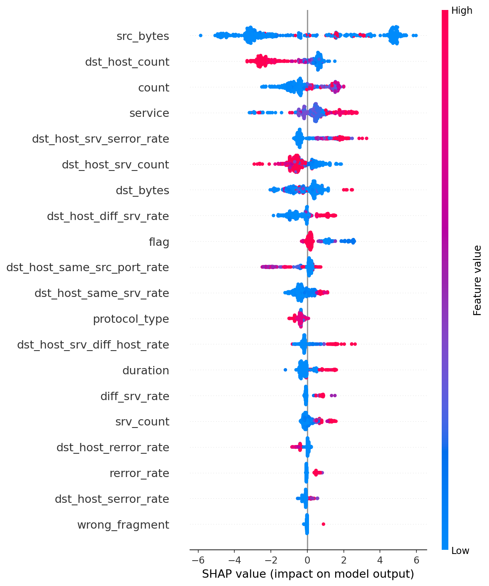
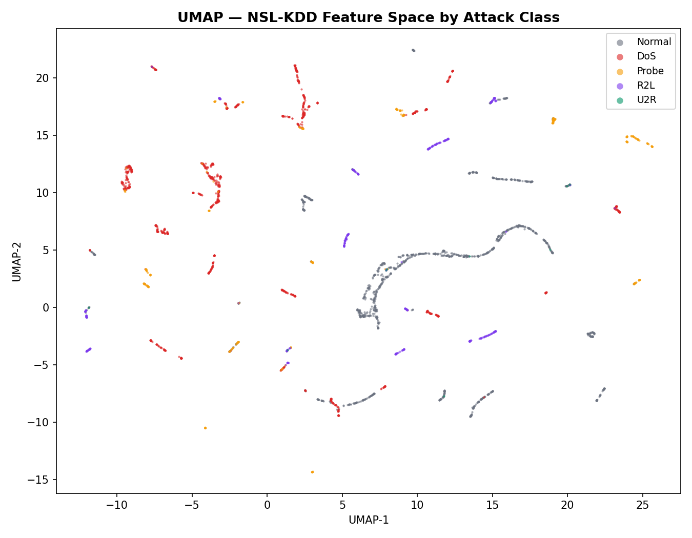
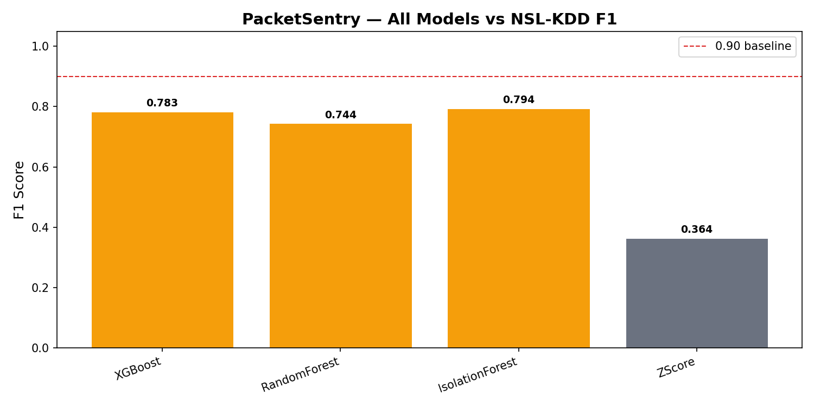

<p align="center">
  
</p>

<h1 align="center">🛡️ PacketSentry</h1>

<p align="center">
  <strong>AI-Powered Network Intrusion Detection System — Built From Scratch</strong>
</p>

<p align="center">
  <em>7-model ML ensemble · From-scratch Aho-Corasick & GraphSAGE GNN · SHAP-explainable alerts · Real-time TUI dashboard</em>
</p>

<p align="center">
  <a href="#-quick-start"></a>
  <a href="#-test-suite"></a>
  <a href="#-7-model-ensemble"></a>
  <a href="LICENSE"></a>
  <a href="#-code-coverage"></a>
</p>

<p align="center">
  <a href="#-architecture">Architecture</a> •
  <a href="#-7-model-ensemble">Ensemble</a> •
  <a href="#-key-features">Features</a> •
  <a href="#-quick-start">Quick Start</a> •
  <a href="#-project-structure">Structure</a> •
  <a href="#-tech-stack">Tech Stack</a> •
  <a href="#-contributing">Contributing</a>
</p>

---

## 📋 Table of Contents

- [Why PacketSentry?](#-why-packetsentry)
- [Architecture](#-architecture)
- [7-Model Ensemble](#-7-model-ensemble)
- [Key Features](#-key-features)
- [Quick Start](#-quick-start)
- [Usage](#-usage)
- [Project Structure](#-project-structure)
- [Tech Stack](#-tech-stack)
- [Test Suite](#-test-suite)
- [Research References](#-research-references)
- [Contributing](#-contributing)
- [License](#-license)

---

## 💡 Why PacketSentry?

Commercial NIDS tools like Snort and Suricata are **black boxes** — they detect intrusions but never explain *why*. SOC analysts are left guessing.

PacketSentry takes a different approach:

- 🔍 **Every alert is explainable** — SHAP feature attribution on every detection
- 🧠 **7 complementary detectors** — signatures, supervised ML, unsupervised anomaly, temporal patterns, and graph topology analysis running simultaneously
- 🔧 **Core algorithms built from scratch** — Aho-Corasick trie and GraphSAGE GNN with zero black-box library dependencies
- 📊 **Self-calibrating** — false positive feedback automatically adjusts detector weights
- 🧬 **Attack memory** — ChromaDB stores 64-dim fingerprints of every alert for similarity search

> *"PacketSentry applies Zero Trust philosophy: every packet is treated as potentially malicious until it passes both signature verification AND anomaly scoring. The ensemble arbiter IS the verification layer."*

---

## 🏗 Architecture

```
                        ┌──────────────────────────────┐
                        │   Live Traffic / PCAP File   │
                        └──────────────┬───────────────┘
                                       ▼
                        ┌──────────────────────────────┐
                        │   Scapy Capture Layer        │
                        │   live.py  |  replay.py      │
                        └──────────────┬───────────────┘
                                       ▼
                        ┌──────────────────────────────┐
                        │   Detection Pipeline         │
                        │   capture/pipeline.py        │
                        └──────────────┬───────────────┘
                                       ▼
              ┌────────────────────────────────────────────────┐
              │              Flow Tracker                      │
              │   Bidirectional 5-tuple grouping, 60s window   │
              └────────────────────┬───────────────────────────┘
                                   ▼
              ┌────────────────────────────────────────────────┐
              │          Feature Extractor (23 dims)           │
              │   NSL-KDD aligned: duration, bytes, flags,    │
              │   connection behavior, service rates           │
              └────────────────────┬───────────────────────────┘
                                   ▼
   ┌──────────────────────────────────────────────────────────────────┐
   │                   7-MODEL DETECTION ENSEMBLE                     │
   │                                                                  │
   │  ┌───────────┐ ┌──────────┐ ┌──────────┐ ┌──────────────────┐  │
   │  │Aho-Corasick│ │ XGBoost  │ │ Random   │ │ Isolation Forest │  │
   │  │ (scratch) │ │ + SHAP   │ │ Forest   │ │ (self-trains)    │  │
   │  │ w=0.20    │ │ w=0.22   │ │ w=0.08   │ │ w=0.12           │  │
   │  └───────────┘ └──────────┘ └──────────┘ └──────────────────┘  │
   │  ┌───────────────────┐ ┌──────────────┐ ┌───────────────────┐  │
   │  │ Transformer AE    │ │ GNN          │ │ Z-Score           │  │
   │  │ (temporal)        │ │ (GraphSAGE,  │ │ (Welford online)  │  │
   │  │ w=0.15            │ │  scratch)    │ │ w=0.08            │  │
   │  │                   │ │ w=0.15       │ │                   │  │
   │  └───────────────────┘ └──────────────┘ └───────────────────┘  │
   └──────────────────────────┬───────────────────────────────────────┘
                              ▼
              ┌────────────────────────────────────────┐
              │       Ensemble Arbiter (0.50)          │
              │  Weighted confidence + FP feedback     │
              └────────────────┬───────────────────────┘
                               ▼
              ┌────────────────────────────────────────┐
              │          Alert Engine                   │
              │  Severity · Dedup · SHAP explanation    │
              └──────┬─────────────────┬───────────────┘
                     ▼                 ▼
           ┌──────────────┐  ┌──────────────────┐
           │   DuckDB     │  │    ChromaDB       │
           │ "What        │  │ "What does this   │
           │  happened?"  │  │  look like?"      │
           └──────────────┘  └──────────────────┘
                     └──────────┬──────────┘
                                ▼
              ┌────────────────────────────────────────┐
              │       Textual TUI Dashboard            │
              │  StatsBar · FlowLog · AlertPanel       │
              └────────────────────────────────────────┘
```

---

## 🎯 7-Model Ensemble

| # | Model | Weight | Type | What It Catches | From Scratch? |
|---|-------|--------|------|-----------------|:---:|
| 1 | **Aho-Corasick** | 0.20 | Signature | SQLi, XSS, path traversal, known CVE patterns | ✅ |
| 2 | **XGBoost + SHAP** | 0.22 | Supervised | Learned attack features (NSL-KDD, 97% precision) | — |
| 3 | **Random Forest** | 0.08 | Supervised | Baseline comparison model | — |
| 4 | **Isolation Forest** | 0.12 | Unsupervised | Statistical outliers from your network's baseline | — |
| 5 | **Transformer AE** | 0.15 | Temporal | Slow port scans, C2 beaconing, DDoS ramp-ups | — |
| 6 | **GNN (GraphSAGE)** | 0.15 | Topology | DDoS fan-out, port scan stars, C2 infrastructure | ✅ |
| 7 | **Z-Score** | 0.08 | Statistical | Per-feature Welford online anomaly detection | — |

> 💡 **Every alert includes SHAP feature attribution** — top-5 contributing features with scores (e.g., `dst_bytes ↑0.42, flag_syn ↑0.31`). No black-box decisions.

---

## ✨ Key Features

<details>
<summary><strong>🔬 From-Scratch Algorithms</strong></summary>

- **Aho-Corasick**: Trie data structure + BFS failure function — O(n) multi-pattern matching regardless of pattern count. 1 or 10,000 signatures, same speed.
- **GraphSAGE GNN**: Complete graph neural network via raw matrix operations — no PyTorch Geometric. Models live traffic as a dynamic graph (IPs as nodes, flows as edges). Catches **topology attacks** invisible to per-flow classifiers.

</details>

<details>
<summary><strong>🧠 Self-Training Detectors</strong></summary>

- **Isolation Forest** self-trains after 500 flows of network baseline
- **Transformer AE** self-trains after 2000 flows (20 epochs)
- **GNN** self-trains after 2000 flows on graph topology
- The ensemble's **FP feedback loop** automatically reduces weights for noisy detectors

</details>

<details>
<summary><strong>🔍 Explainable AI (GDPR Compliant)</strong></summary>

- **SHAP TreeExplainer** on every XGBoost alert
- Top-5 contributing features shown per alert
- Satisfies GDPR's "right to explanation" requirement
- Example: `"High dst_bytes (+0.42), SYN flood pattern (+0.31), unusual srv_count (+0.18)"`

</details>

<details>
<summary><strong>💾 Dual Storage Architecture</strong></summary>

Two complementary stores for different query patterns:

| Store | Technology | Query Type |
|-------|-----------|-----------|
| **DuckDB** | Columnar SQL | `WHERE severity='HIGH' AND ts > now()-1h` |
| **ChromaDB** | Vector (cosine) | `find_similar(embedding, n=5)` |

DuckDB answers **"what happened"**. ChromaDB answers **"what does this look like"**.

</details>

<details>
<summary><strong>📊 Real-Time TUI Dashboard</strong></summary>

- Live packets-per-second, flow count, and alert count
- Scrolling flow log table
- Severity-coded alert panel (🔴 CRITICAL → 🟠 HIGH → 🟡 MED → ⚪ LOW)
- Keyboard shortcuts: `q` quit, `p` pause/resume

</details>

---

## 🚀 Quick Start

### Prerequisites

| Requirement | Details |
|-------------|---------|
| **Python** | 3.12+ |
| **Npcap** *(Windows only)* | [Download](https://npcap.com) — required for live capture, NOT for PCAP replay |
| **Root/sudo** *(Linux only)* | Or `CAP_NET_RAW` capability for live capture |

### Installation

```bash
# Clone the repo
git clone https://github.com/shreyshringare/PacketSentry.git
cd PacketSentry

# Install (editable mode)
pip install -e .
```

### Verify Installation

```bash
python -m pytest tests/ -q
# 241 passed ✅
```

---

## 📖 Usage

### Replay a PCAP File (No Admin Required)

```bash
packetsentry replay attack.pcap --speed 0.0
```

Output:
```
Replaying: attack.pcap at speed=0.0x
  🚨 CRITICAL conf=0.94 aho=0.85 xgb=0.92 gnn=0.31
  🚨 HIGH     conf=0.78 aho=0.00 xgb=0.81 gnn=0.65

┌─────── Replay Summary ───────┐
│ Metric   │ Value             │
│ Packets  │ 12,847            │
│ Flows    │ 1,234             │
│ Alerts   │ 42                │
│ Duration │ 3.21s             │
└──────────┴───────────────────┘
```

### Live Capture with TUI Dashboard

```bash
# Windows (requires Npcap)
packetsentry live --interface "Wi-Fi"

# Linux (requires root)
sudo packetsentry live --interface eth0
```

### View Alert History

```bash
packetsentry alerts --last 50
```

### Benchmark Aho-Corasick vs Regex

```bash
packetsentry bench --patterns 1000 --text-size 10MB
```

<details>
<summary><strong>🏋️ Training XGBoost on NSL-KDD</strong></summary>

```bash
# 1. Download NSL-KDD dataset
mkdir -p data/nslkdd
# Place KDDTrain+.txt and KDDTest+.txt in data/nslkdd/

# 2. Train with Optuna HPO + SMOTE
python scripts/train_xgboost.py --dataset data/nslkdd/ --output models/

# Output:
# Best trial: ROC-AUC 0.9735
# Exported: models/xgb_nslkdd.json + models/xgb_metadata.json
```

</details>

---

## 📁 Project Structure

```
packetsentry/
├── 📦 capture/
│   ├── pipeline.py          # End-to-end orchestrator (the "main" brain)
│   ├── live.py              # Scapy sniff loop → ParsedPacket
│   └── replay.py            # PCAP playback with speed control
│
├── 🔍 detection/
│   ├── aho_corasick.py      # FROM SCRATCH — Trie + BFS failure links
│   ├── gnn_detector.py      # FROM SCRATCH — GraphSAGE message passing
│   ├── xgboost_detector.py  # Primary classifier + SHAP explainability
│   ├── transformer_ae.py    # Temporal anomaly (self-attention encoder)
│   ├── random_forest.py     # Baseline comparison
│   ├── isolation_forest.py  # Unsupervised, self-trains on 500 flows
│   ├── zscore.py            # Welford online z-score
│   ├── ensemble.py          # 7-model weighted arbiter + FP feedback
│   └── explainer.py         # SHAP TreeExplainer wrapper
│
├── 🧬 features/
│   ├── flow_tracker.py      # Bidirectional flow grouping (60s window)
│   ├── extractor.py         # 23 NSL-KDD aligned feature computation
│   └── preprocessor.py      # StandardScaler + NaN handling + persistence
│
├── 💾 storage/
│   ├── embedding.py         # 64-dim L2-normalized Transformer hidden state
│   └── vector_store.py      # ChromaDB cosine similarity wrapper
│
├── 🚨 alerts/
│   ├── engine.py            # Severity classification + dedup + routing
│   └── store.py             # DuckDB persistence layer
│
├── 📊 tui/
│   └── dashboard.py         # Textual TUI (StatsBar, FlowLog, AlertPanel)
│
├── 🧪 dissector/            # Protocol parsers (Ethernet/IP/TCP/UDP/DNS)
│
└── cli.py                   # Typer CLI entrypoint
```

---

## 📊 Benchmark Results — NSL-KDD (22,544 test samples)

| Model | F1 | Precision | Recall | ROC-AUC |
|---|---|---|---|---|
| XGBoost + SHAP | 0.784 | — | — | 0.950 |
| Random Forest | 0.744 | — | — | 0.965 |
| Isolation Forest *(unsupervised)* | 0.795 | — | — | 0.925 |
| Z-Score *(statistical)* | 0.364 | — | — | 0.847 |
| Transformer AE *(temporal)* | — | — | — | — |
| GNN / GraphSAGE | topology-only* | — | — | — |
| Aho-Corasick | signature-only* | — | — | — |

> *GNN requires a live network graph; Aho-Corasick requires raw packet payloads. Both contribute to the live ensemble but are not scored against per-flow datasets.*
>
> Reproduce: `python scripts/evaluate_all.py --dataset data/nslkdd/ --output results/`

### SHAP Feature Attribution

Every alert ships with a SHAP explanation. Top features driving attack classification:



### Attack Class Separation (UMAP)

64-dim flow embeddings projected to 2D — distinct clusters for DoS, Probe, R2L, U2R:



### Model Comparison



---

## ⚙️ Tech Stack


| Layer | Technology | Why This Choice |
|-------|-----------|----------------|
| **Capture** | Scapy 2.5 | Python-native pcap, cross-platform |
| **Signatures** | Aho-Corasick *(scratch)* | O(n) multi-pattern — same speed for 1 or 10,000 patterns |
| **ML Primary** | XGBoost 2.0 + SHAP | Industry standard for tabular + native explainability |
| **Temporal** | Transformer AE *(PyTorch)* | Self-attention captures long-range dependencies |
| **Topology** | GraphSAGE GNN *(scratch)* | E-GraphSAGE-inspired, catches DDoS/scan topology patterns |
| **Unsupervised** | Isolation Forest | Self-trains on your network's unique baseline |
| **Statistical** | Z-Score *(Welford)* | Online mean/variance — zero memory overhead |
| **Vector Memory** | ChromaDB 0.4 | Cosine similarity over 64-dim attack fingerprints |
| **Alert Store** | DuckDB 0.10 | In-process OLAP — 10× faster than SQLite for analytics |
| **Dashboard** | Textual 0.52 | Rich terminal UI with reactive updates |
| **CLI** | Typer 0.12 | Type-hint driven, auto-generated `--help` |
| **Training** | Optuna + SMOTE | Bayesian HPO + class imbalance handling |
| **Testing** | pytest | 241 tests, 76% coverage |
| **Linting** | Ruff | Replaces flake8 + black + isort |

---

## 🧪 Test Suite

```
Phase 1 — Scaffold + Aho-Corasick .............. 73 tests  ✅
Phase 2 — Dissectors + Flow + Features ......... 64 tests  ✅
Phase 3 — XGB + RF + IF + ZS + Ensemble ........ 55 tests  ✅
Phase 4 — Transformer AE + GNN + Storage ....... 42 tests  ✅
Phase 5 — Pipeline + Capture + Alerts ........... 7 tests  ✅
──────────────────────────────────────────────────────────────
TOTAL                                           241 tests  ✅
Coverage                                            76%
```

### 📊 Code Coverage

| Module | Coverage |
|--------|:--------:|
| `detection/aho_corasick.py` | 99% |
| `detection/ensemble.py` | 100% |
| `detection/gnn_detector.py` | 94% |
| `detection/transformer_ae.py` | 96% |
| `features/flow_tracker.py` | 99% |
| `features/extractor.py` | 99% |
| `capture/pipeline.py` | 92% |
| `alerts/engine.py` | 98% |

---

## 📚 Research References

This project draws inspiration from recent NIDS research:

| Paper | Year | Key Contribution | Influence on PacketSentry |
|-------|:----:|-----------------|--------------------------|
| **E-GraphSAGE** *(Lo et al.)* | 2022 | Edge-centric GNN for flow-based NIDS | Inspired our from-scratch GNN architecture |
| **DIGNN-A** *(Liu & Guo)* | 2025 | Dynamic graph + multi-head attention, 99.96% on UNSW-NB15 | Validated dynamic graph approach |
| **E-GraphSAGE++** | 2024 | Improved edge features + scalability | Informed edge feature engineering |
| **GConvTrans** | 2024 | Hybrid GNN + Transformer | Confirmed dual temporal+topology approach |
| **CiENA GNN** *(Ciena Research)* | 2024 | In-time graphical neural network detection | Informed real-time graph construction |

---

## 🤝 Contributing

Contributions are welcome! Here's how:

1. **Fork** the repository
2. **Create** your feature branch (`git checkout -b feat/amazing-feature`)
3. **Commit** your changes (`git commit -m 'feat(module): add amazing feature'`)
4. **Push** to the branch (`git push origin feat/amazing-feature`)
5. **Open** a Pull Request

### Commit Convention

```
feat(module): description     # New feature
fix(module): description      # Bug fix
test(module): description     # Adding tests
docs: description             # Documentation
```

---

## 📄 License

Distributed under the **MIT License**. See `LICENSE` for more information.

---

## 👤 Author

**Shreyas Shringare**

- GitHub: [@shreyshringare](https://github.com/shreyshringare)

---

<p align="center">
  <sub>Built with ❤️ and a deep suspicion of every packet on the wire.</sub>
</p>
