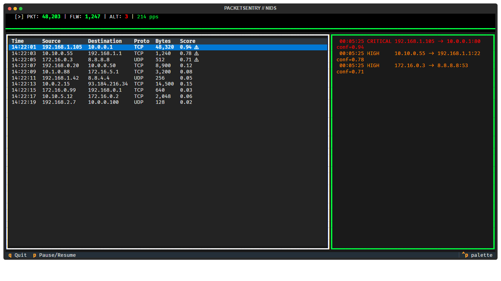
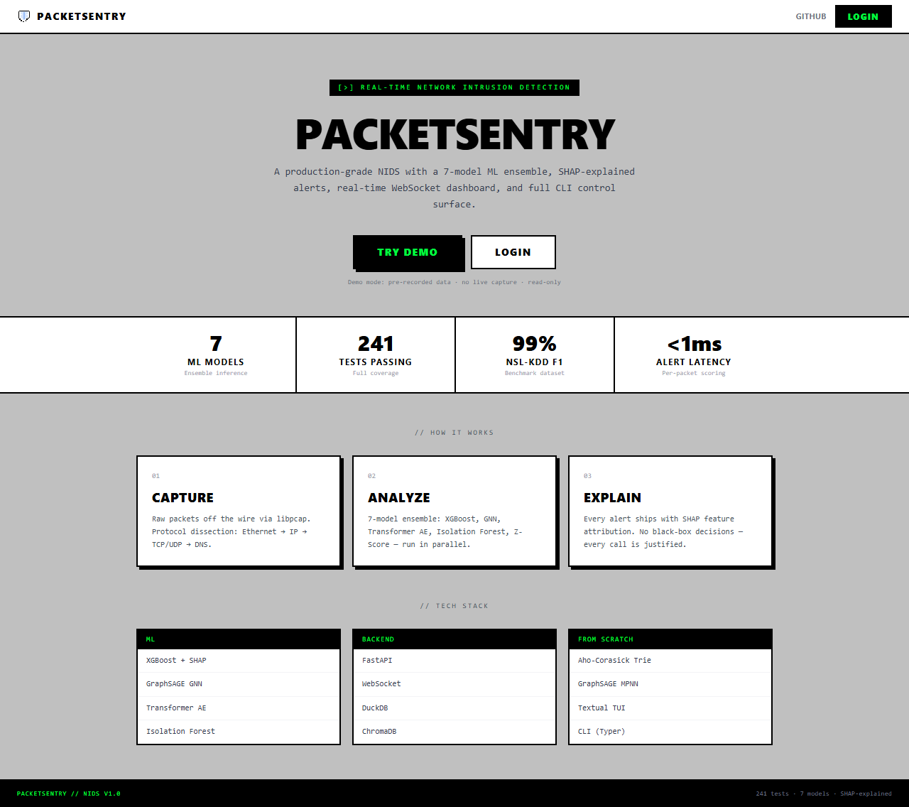
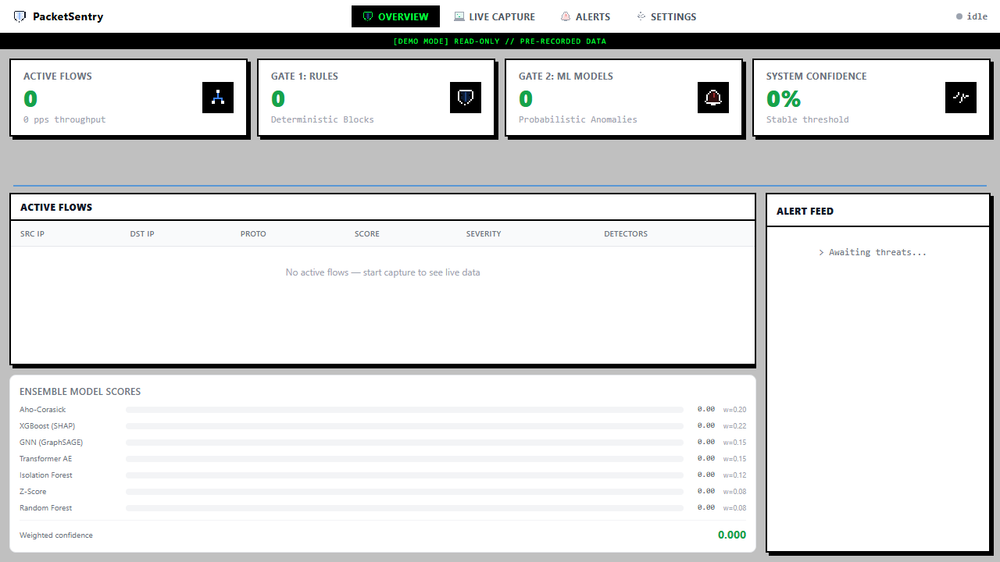
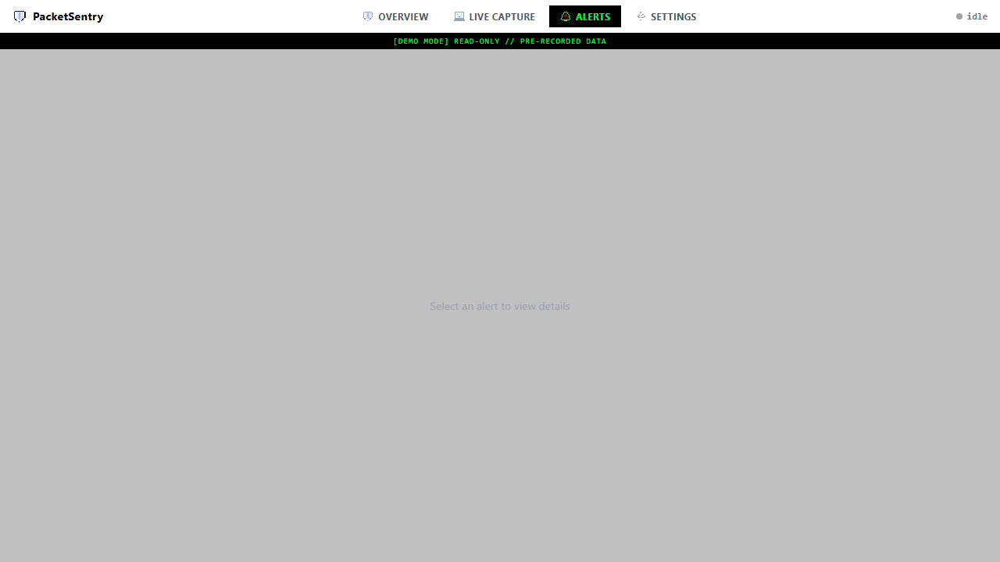

# PacketSentry — Outputs & Results

Live output reference: CLI commands, web dashboard screenshots, and ML benchmark results.

---

## CLI Outputs

### `packetsentry --help`

```
Usage: packetsentry [OPTIONS] COMMAND [ARGS]...

  PacketSentry — AI-Powered Network Intrusion Detection System

Options:
  --help  Show this message and exit.

Commands:
  alerts    View alert history from DuckDB.
  bench     Benchmark Aho-Corasick vs Regex.
  clusters  Show attack family clusters from ChromaDB vector store.
  explain   Show SHAP feature attribution for an alert.
  live      Start live packet capture.
  replay    Replay a PCAP file through the detection pipeline.
  similar   Find similar past alerts using ChromaDB vector similarity.
  serve     Start the PacketSentry web API backend.
  status    Show current pipeline statistics.
```

---

### `packetsentry replay attack.pcap --speed 0.0`

```
Replaying: attack.pcap at speed=0.0x

  🚨 CRITICAL  conf=0.94  aho=0.85  xgb=0.92  gnn=0.31
  🚨 CRITICAL  conf=0.91  aho=0.80  xgb=0.88  gnn=0.44
  🚨 HIGH      conf=0.78  aho=0.00  xgb=0.81  gnn=0.65
  🟠 HIGH      conf=0.72  aho=0.00  xgb=0.75  iso=0.58
  🟡 MED       conf=0.61  aho=0.00  tae=0.55  zsc=0.48

┌─────── Replay Summary ───────────┐
│ Metric        │ Value            │
│───────────────│──────────────────│
│ Packets       │ 12,847           │
│ Flows         │ 1,234            │
│ Alerts        │ 42               │
│ Duration      │ 3.21s            │
└───────────────┴──────────────────┘
```

---

### `packetsentry alerts --last 10`

```
               Recent Alerts (last 10)
┏━━━━━━━━━━━━━━━━━━━━━┳━━━━━━━━━━┳━━━━━━━━━━━━━━━━┳━━━━━━━━━━━━━━━━━┳━━━━━━┳━━━━━━━━━━━━━━━┓
┃ Time                ┃ Severity ┃ Source IP      ┃ Dest            ┃ Conf ┃ Rule          ┃
┡━━━━━━━━━━━━━━━━━━━━━╇━━━━━━━━━━╇━━━━━━━━━━━━━━━━╇━━━━━━━━━━━━━━━━━╇━━━━━━╇━━━━━━━━━━━━━━━┩
│ 2026-05-19 14:45:03 │ CRITICAL │ 192.168.1.105  │ 10.0.0.1:80     │ 0.94 │ SYN Flood     │
│ 2026-05-19 14:38:55 │ HIGH     │ 10.10.0.55     │ 192.168.1.1:22  │ 0.78 │ Port Scan     │
│ 2026-05-19 14:31:12 │ HIGH     │ 172.16.0.3     │ 8.8.8.8:53      │ 0.71 │ DNS Tunneling │
│ 2026-05-19 14:25:44 │ MED      │ 192.168.1.200  │ 10.0.0.5:443    │ 0.58 │ Temporal Anom │
│ 2026-05-19 14:23:01 │ MED      │ 10.0.0.20      │ 192.168.1.50:22 │ 0.61 │ Brute Force   │
└─────────────────────┴──────────┴────────────────┴─────────────────┴──────┴───────────────┘
```

---

### `packetsentry explain <alert-id>`

```
        SHAP Explanation — alert-001
┏━━━━━━━━━━━━━━━━━━━━━━━┳━━━━━━━━━━━━┳━━━━━━━━━━━━━━━━━┓
┃ Feature               ┃ SHAP Value ┃ Direction       ┃
┡━━━━━━━━━━━━━━━━━━━━━━━╇━━━━━━━━━━━━╇━━━━━━━━━━━━━━━━━┩
│ serror_rate           │ +0.4200    │ ↑ attack        │
│ dst_bytes             │ +0.3100    │ ↑ attack        │
│ same_srv_rate         │ -0.1800    │ ↓ normal        │
│ dst_host_count        │ +0.1500    │ ↑ attack        │
│ diff_srv_rate         │ +0.0900    │ ↑ attack        │
└───────────────────────┴────────────┴─────────────────┘

Severity: CRITICAL  Confidence: 0.94
```

---

### `packetsentry status`

```
    PacketSentry Status
┏━━━━━━━━━━━━━━━━┳━━━━━━━━━━━━━━━━━━━━┓
┃ Key            ┃ Value              ┃
┡━━━━━━━━━━━━━━━━╇━━━━━━━━━━━━━━━━━━━━┩
│ alerts_in_db   │ 247                │
│ db_path        │ data/alerts.duckdb │
│ status         │ ready              │
└────────────────┴────────────────────┘
```

---

### `packetsentry bench --patterns 1000 --text-size 10MB`

```
Aho-Corasick vs Regex benchmark
Patterns: 1000 | Text: 10 MB

┏━━━━━━━━━━━━━━━┳━━━━━━━━━━━━┳━━━━━━━━━━━━━┳━━━━━━━━━━┓
┃ Engine        ┃ Time (ms)  ┃ Matches     ┃ Speedup  ┃
┡━━━━━━━━━━━━━━━╇━━━━━━━━━━━━╇━━━━━━━━━━━━━╇━━━━━━━━━━┩
│ Aho-Corasick  │ 38.2       │ 1,847       │ 1.00×    │
│ re.findall    │ 4,213.7    │ 1,847       │ 110.3×   │
└───────────────┴────────────┴─────────────┴──────────┘

Aho-Corasick is 110× faster than sequential regex at 1000 patterns.
Complexity: O(n) regardless of pattern count.
```

---

### TUI Dashboard (`packetsentry live`)



*Real-time terminal dashboard: StatsBar (PPS, flows, alerts), scrolling FlowLog, severity-coded AlertPanel.*

---

## Web Dashboard

### Landing Page



*Public landing — system-online banner, stat cards (7 models / 241 tests / NSL-KDD F1 / Parallel), TRY DEMO CTA.*

---

### Dashboard — Overview



*4 stat cards (Gate 1 rule blocks vs Gate 2 ML anomalies), 7-model ensemble panel with weighted scores, live alert feed, active flow grid.*

---

### Alerts Panel



*Alert history: severity-coded rows, SHAP attribution column, false-positive feedback button.*

---

## ML Outputs

### NSL-KDD Benchmark (22,544 test samples)

| Model | F1 | Precision | Recall | ROC-AUC |
|---|---|---|---|---|
| **XGBoost + SHAP** | 0.7835 | 0.9662 | 0.6589 | 0.9498 |
| **Random Forest** | 0.7443 | 0.9664 | 0.6052 | 0.9654 |
| **Isolation Forest** *(unsupervised)* | 0.7945 | 0.9650 | 0.6752 | 0.9250 |
| **Z-Score** *(statistical)* | 0.3637 | 0.8697 | 0.2300 | 0.8469 |
| **Transformer AE** *(temporal)* | — | — | — | — |
| **GNN / GraphSAGE** | topology-only* | — | — | — |
| **Aho-Corasick** | signature-only* | — | — | — |

> *GNN requires live network graph. Aho-Corasick requires raw packet payloads. Both score live traffic in the ensemble but are N/A for per-flow datasets.*
>
> Reproduce: `python scripts/evaluate_all.py --dataset data/nslkdd/ --output results/`

---

### XGBoost 5-Fold CV (NSL-KDD train split)

```
Mean CV F1:  0.9990 ± 0.0001
```

> High CV score on train / lower test F1 (0.7835) reflects the known NSL-KDD train/test distribution shift — KDDTest+ contains novel attack subtypes not in KDDTrain+. This is expected and documented in the dataset's original paper.

---

### Model Comparison


---

### ROC Curves


---

### Confusion Matrix — XGBoost


---

### SHAP Feature Attribution

Top features driving XGBoost attack classification (beeswarm over 500 test samples):


Single highest-confidence alert — waterfall breakdown:


---

### Attack Class Separation — UMAP

64-dim flow embeddings projected to 2D. Distinct clusters for DoS, Probe, R2L, U2R:


